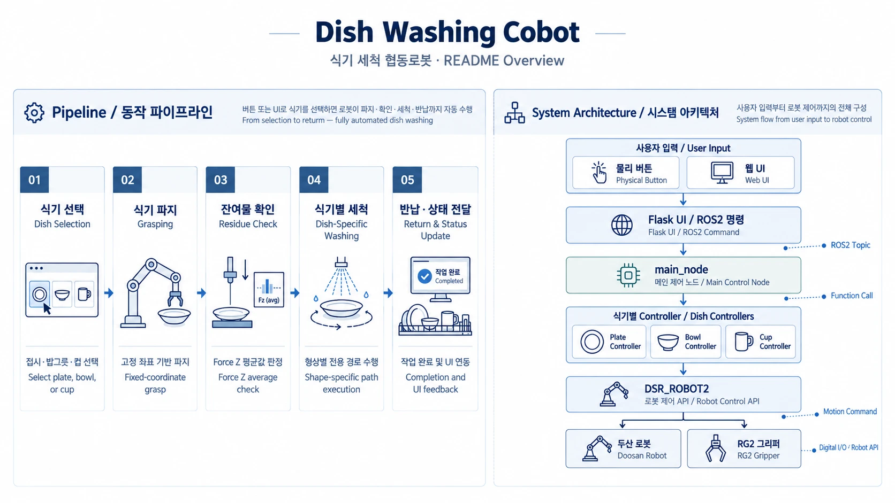
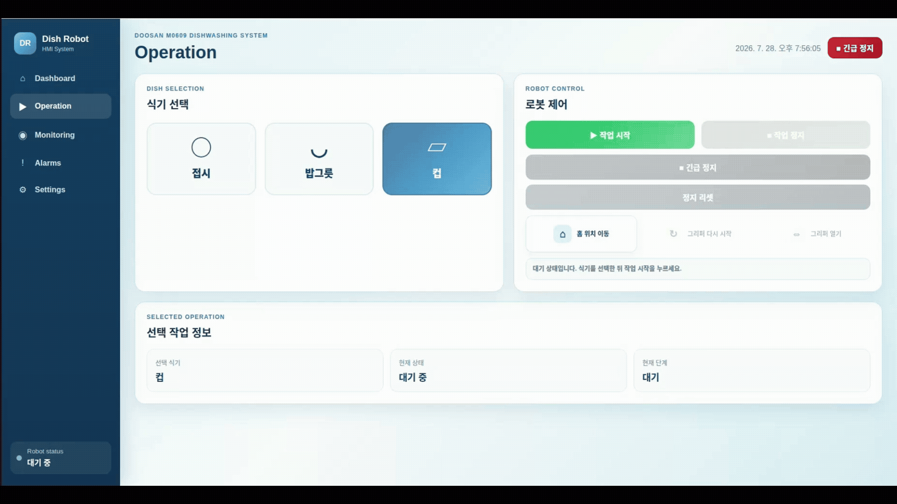

<div align="center">

# Dish-Washing-Cobot

### Shape-Adaptive Contact Washing with Doosan M0609  
### Doosan M0609 협동로봇 기반 식기 형상별 접촉 세척 시스템

접시·그릇·컵을 파지하고, 식기 형상에 맞는 세척 궤적과  
**Force / Compliance Control + Re-grasping**을 적용한 ROS2 기반 협동로봇 프로젝트

[](https://docs.ros.org/en/humble/)
[](https://www.python.org/)
[](https://www.doosanrobotics.com/)
[](https://onrobot.com/)
[](https://flask.palletsprojects.com/)

</div>

---

## Overview

기존 식기세척기의 분사 방식과 달리, 본 프로젝트는 **협동로봇이 세척 도구를 이용해 식기 표면을 직접 접촉 세척**하도록 구성함.

접시, 그릇, 컵은 형상과 접근 방향이 서로 다르기 때문에 하나의 공통 경로만으로는 안정적인 세척이 어려움.  
이를 해결하기 위해 식기별 파지·세척 시퀀스를 분리하고, **Joint / Linear / Circular Motion, Force / Compliance Control, Re-grasping**을 조합함.

사용자는 물리 버튼 또는 Flask Web UI에서 식기를 선택 가능하며, `main_node`가 작업 상태를 관리하고 식기별 Controller를 호출함.

---

## Demo

<div align="center">
  
  <br>
  <sub>Dish selection → grasping → washing → return</sub>
</div>

---

## Key Contributions

1. **Shape-Specific Washing Trajectory**  
   접시·그릇·컵의 형상에 따라 직선, 곡선, 나선(소용돌이), 둘레 방향 이동을 조합한 전용 세척 경로 구성.

2. **Contact-Aware Washing Control**  
   Force / Compliance 제어를 이용해 세척 도구와 식기 사이의 접촉을 유지하고 위치 오차 완화.

3. **Re-grasping for Occluded Regions**  
   RG2가 가리는 영역까지 세척하기 위해 식기를 뒤집거나 다시 파지하는 시퀀스 적용.

4. **ROS2 Task Orchestration**  
   `main_node`에서 상태와 명령을 관리하고 Plate / Bowl / Cup Controller 분리.

5. **Operator Interface & Stop Handling**  
   물리 버튼과 Flask UI를 통한 작업 제어, `DR_QSTOP` + Motion Guard 기반 정지/복구 로직 구성.

---

## System

<div align="center">
  
  <br>
  <sub>동작 파이프라인 (좌) / 시스템 아키텍처 (우)</sub>
</div>
<br><br>

<div align="center">

| Phase | Description |
|---|---|
| **1. Dish Selection** | 물리 버튼 또는 Web UI에서 Plate / Bowl / Cup 선택 |
| **2. Grasping** | 식기별 고정 좌표 및 파지 시퀀스로 RG2 제어 |
| **3. Contact / Load Check** | Force Z 값을 이용해 접촉 또는 하중 상태 확인 |
| **4. Washing** | 식기 형상에 맞는 전용 세척 궤적 수행 |
| **5. Return** | 세척 완료 후 식기를 거치대로 이동하고 상태 갱신 |

</div>

---

## Dish-Specific Motion

<div align="center">

| Dish | Washing Strategy | Implementation |
|:---:|:---:|:---|
| **Plate**<br>접시 | Linear sweeping<br>+ circular motion | 앞/뒷면 분리 세척, 재파지 후 가려진 영역까지 세척 |
| **Bowl**<br>그릇 | Inner spiral<br>+ circumference<br>+ outer spiral | 곡면 추종에 `DR_MV_ORI_RADIAL` 사용 |
| **Cup**<br>컵 | Inner + outer<br>+ handle washing | 뒤집기·재파지로 내부, 외부, 손잡이 순차 세척 |

</div>

### Plate
- 넓은 평면은 **Linear Sweeping** 중심으로 세척
- 필요한 구간에 Circular Motion 적용
- 앞/뒤면을 분리해 세척
- 재파지를 통해 RG2가 가리는 영역까지 접근

### Bowl
- 내부는 Spiral trajectory
- 가장자리는 둘레 방향으로 세척
- 외부 곡면은 자세를 변경하며 추종
- Native DRL의 `DR_MV_ORI_RADIAL`로 곡면 Orientation 처리

### Cup
- 내부 / 외부 / 손잡이를 별도 단계로 분리
- 구조물 및 그리퍼 간섭을 피하기 위해 뒤집기와 재파지 수행

---

## Control Architecture

```text
Physical Button ─┐
                 ├──> ROS2 Command ──> main_node
Flask Web UI ────┘                         │
                                           ├──> Plate Controller ──┐
                                           ├──> Bowl Controller  ──┼──> DSR_ROBOT2 ──┬──> Doosan M0609
                                           └──> Cup Controller   ──┘                 └──> OnRobot RG2
```

- **ROS Executor** — 명령, 상태, 버튼, 모니터링 데이터 처리
- **Motion Thread** — 실제 세척 시퀀스 수행
- **Dish Controller** — 식기별 파지·세척 동작 분리
- **DSR_ROBOT2** — Joint / Linear / Circular / Force 제어
- **OnRobot RG2** — 식기 파지 및 재파지

### Stop Handling

```text
                 RUN
                  │ stop
          ┌───────┴────────┐
      DR_QSTOP       motion_guard.abort = True
          └───────┬────────┘
                  ▼
         current motion stop
                  ▼
     remaining sequence blocked
                  ▼
                STOP
                  ▼
                reset
                  ▼
                IDLE
```

---

## Web UI

<div align="center">
  
  <br>
  <sub>Robot monitoring, command, and operator interface.</sub>
</div>

---

## Engineering Challenges

<div align="center">

| Problem | Solution |
|---|---|
| `movel` 이동 중 Singularity 발생 | 안정적인 관절 자세를 갖는 `movej` 경유점 추가 |
| 접시 세척 중 RG2와 식기 간섭 | 곡선 중심 경로에서 Linear Sweeping 중심으로 변경 |
| 컵 재파지 시 위치 오차 누적 | 접촉 기반 위치 재정렬 로직 적용 |
| 컵 외부 세척 중 구조물 간섭 | 세척 영역 분할 + 재파지 후 나머지 영역 처리 |
| 그릇 곡면에서 Orientation 추종 한계 | Native DRL + `DR_MV_ORI_RADIAL` 적용 |

</div>

---

## Environment

<div align="center">

| Category | Specification |
|---|---|
| OS | Ubuntu 22.04 |
| Middleware | ROS2 Humble |
| Robot | Doosan Robotics M0609 |
| Gripper | OnRobot RG2 |
| Language | Python 3 |
| Robot API | `DSR_ROBOT2` |
| HMI | Flask / HTML / CSS |
| Communication | ROS2 Topic / Service, Modbus TCP |
| Motion | Joint / Linear / Circular Motion |
| Contact Control | Force / Compliance Control |

</div>

실제 로봇 구동 시 필요 항목

- Doosan ROS2 package: `dsr_msgs2`, `DSR_ROBOT2`, `DR_init`
- `m0609_rg2_bringup` 또는 동일 기능의 Bringup package
- Teach Pendant에 설정된 Tool / TCP / User Coordinate
- 실제 설치 환경에 맞게 측정한 Waypoint
- OnRobot Compute Box 사용 시 Modbus TCP 연결

---

## Installation

```bash
cd ~/ws_cobot_pjt/ws_dsr
source /opt/ros/humble/setup.bash

colcon build --symlink-install \
  --packages-select dish_washing_cobot ui_ros

source install/setup.bash
```

UI dependencies:

```bash
python3 -m pip install --user -r ui_ros/ui/requirements.txt
```

---

## Usage

### 1. Robot Bringup

```bash
ros2 launch m0609_rg2_bringup bringup.launch.py \
  mode:=real \
  host:=192.168.1.100 \
  model:=m0609
```

### 2. Main Controller

```bash
ros2 run dish_washing_cobot main_node
```

### 3. UI ROS Node

```bash
ros2 launch ui_ros ui_ros.launch.py
```

### 4. Flask UI

```bash
cd ~/ws_cobot_pjt/ws_dsr/src/dish_washing_cobot/ui_ros/ui
python3 app.py
```

Open:

```text
http://127.0.0.1:5000
```

### ROS2 Command Example

```bash
ros2 topic pub --once /dishwasher/cmd std_msgs/msg/String "data: plate"
ros2 topic pub --once /dishwasher/cmd std_msgs/msg/String "data: bowl"
ros2 topic pub --once /dishwasher/cmd std_msgs/msg/String "data: cup"

ros2 topic pub --once /dishwasher/cmd std_msgs/msg/String "data: stop"
ros2 topic pub --once /dishwasher/cmd std_msgs/msg/String "data: reset"
ros2 topic pub --once /dishwasher/cmd std_msgs/msg/String "data: home"
```

> Robot IP, Robot ID, Tool, TCP, User Coordinate 및 Waypoint는 실제 장비 환경에 맞게 설정 필요.

---

## Repository Structure

```text
Dish_Washing_Cobot/
├── dish_washing_cobot/          # 메인 ROS2 패키지
│   ├── dish_washing_cobot/
│   │   └── main_node.py         #   상태 관리 · 명령 처리
│   ├── plate/                   #   Plate Controller
│   ├── bowl/                    #   Bowl Controller
│   ├── cup/                     #   Cup Controller
│   ├── common/
│   │   └── motion_guard.py      #   정지 · 복구 처리
│   ├── nodes/
│   └── test/
│
├── ui_ros/                      # ROS2 UI 노드 + Flask UI
│   ├── launch/
│   ├── ui/                      #   app.py, templates, static
│   └── ui_ros/
│
├── assets/                      # README 이미지
│   ├── overview.webp
│   ├── demo2.gif
│   └── ui.gif
│
└── README.md
```

---

<div align="center">

**ROS2 × Doosan Robotics × OnRobot × Flask**

Shape-specific contact washing with a collaborative robot.

</div>
